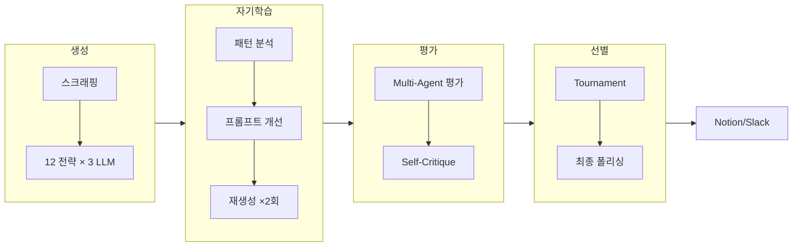

# Fast-Naming

AI 기반 네이밍/슬로건 공모전 작명 자동화 프로젝트

---

## 📁 web/

**배포 URL**: https://accurate-inge-joelonsw-180a8ed4.koyeb.app/

사용자가 직접 공모전 정보를 입력하면 AI가 작명을 생성하고 평가하는 웹 애플리케이션.

- **FastAPI** 백엔드 + **HTML/CSS/JS** 프론트엔드
- 다중 LLM 활용 (Gemini, Groq, GitHub AI, Together AI)
- 6가지 창의적 전략으로 작명 생성
- AI 기반 자동 평가 및 순위 결정

---

## 🤖 agent/

**실행**: GitHub Actions (3일마다 한국시간 22:00)

Wevity 공모전 사이트를 자동으로 스크래핑하여 **1등 수상**을 목표로 작명을 생성하고 알림을 보내는 AI Agent.

### ✨ 핵심 기능

- **12가지 창의적 전략** (한국어 특화 + 1등 달성용 4가지 추가)
- **Multi-Agent 평가** (3개 LLM 교차 평가)
- **재귀적 자기 학습** (Self-Learning Engine)
- **Tournament 선별** + 최종 폴리싱
- **Chain-of-Thought** 프롬프트

### 🔄 Agent 워크플로우



### 📊 LLM 구성

| 제공자 | 모델 | Rate Limit | 용도 |
|--------|------|:----------:|------|
| **Gemini** | gemini-2.5-flash-lite | 10초 | 작명 생성 / 평가 |
| **Groq** | openai/gpt-oss-120b | 2초 | 작명 생성 / 평가 / 자기학습 |
| **GitHub AI** | openai/gpt-4.1-mini | 10초 | 작명 생성 / 평가 |

### 📂 Agent 파일 구조

```
agent/
├── main.py              # 메인 실행 (강화된 파이프라인)
├── scraper.py           # Wevity 스크래핑
├── llm_generator.py     # LLM 작명 생성 (12가지 전략)
├── evaluator.py         # Multi-Agent 평가 시스템
├── refiner.py           # 품질 향상 (Tournament + 폴리싱)
├── self_learning.py     # 🆕 재귀적 자기 학습 엔진
├── slack_notifier.py    # Slack 알림
├── notion_saver.py      # Notion 저장
├── examples_loader.py   # Few-shot 예시 로드
├── state.py             # 타입 정의
└── langgraph-guide.md   # 상세 가이드
```

---

## 🔐 환경 변수

```env
# LLM API Keys
GEMINI_API_KEY=xxx
GROQ_API_KEY=xxx
AI_GITHUB_TOKEN=xxx

# Slack
SLACK_WEBHOOK=https://hooks.slack.com/services/xxx

# Notion
NOTION_API_KEY=secret_xxx
NOTION_PARENT_PAGE_ID=xxx
```

---

## 📚 참고

- [Agent 상세 가이드](./agent/langgraph-guide.md)
