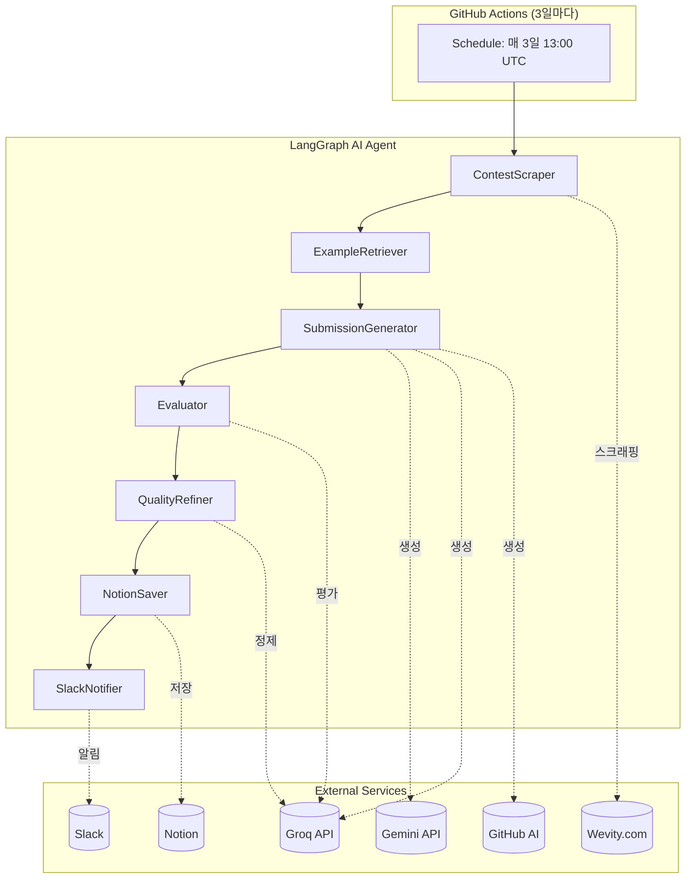
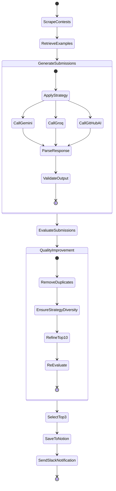

# 🚀 Fast-Naming LangGraph AI Agent 구현 가이드

## 📋 프로젝트 개요

이 Agent는 **GitHub Actions를 통해 3일마다 자동 실행**되어:
1. Wevity 공모전 사이트에서 진행중인 네이밍/슬로건 공모전을 자동 수집
2. **다중 LLM (Gemini, Groq, GitHub AI)**을 활용하여 최적의 작명을 생성 및 평가
3. **8가지 창의적 전략** (한국어 특화 포함) 적용
4. **중복 제거 → 다양성 보장 → 반복 정제** 품질 향상 프로세스
5. TOP 3 결과를 Slack으로 알림 (Notion 링크 포함)
6. Notion에 결과를 정리하여 저장 (전체 후보 포함)

---

## 🏗️ 시스템 아키텍처



---

## 📊 상태 그래프 (State Graph)



---

## 🔧 핵심 컴포넌트 상세

### 1. LLM 제공자 구성

| 제공자 | 모델 | Rate Limit | 429 처리 |
|--------|------|:----------:|:--------:|
| **Gemini** | `gemini-2.5-flash-lite` | 10초 | 재시도 없이 스킵 |
| **Groq** | `openai/gpt-oss-120b` | 2초 | 자동 재시도 |
| **GitHub AI** | `openai/gpt-4.1-mini` | 10초 | 재시도 없이 스킵 |

### 2. 8가지 창의적 전략

```python
CREATIVE_STRATEGIES = [
    {"name": "Keyword Combination", "description": "핵심 키워드 조합"},
    {"name": "Metaphor & Analogy", "description": "은유와 비유"},
    {"name": "Benefit-Oriented", "description": "혜택 중심"},
    {"name": "Wordplay & Wit", "description": "언어유희와 재치"},
    {"name": "Future Vision", "description": "미래 비전"},
    {"name": "Simple & Direct", "description": "단순함과 직관성"},
    # 🆕 한국어 특화 전략
    {"name": "Korean Wordplay", "description": "한국어 말장난 (두운, 각운, 의성어)"},
    {"name": "Korean Cultural Reference", "description": "한국 문화적 레퍼런스"},
]
```

### 3. 공모전 유형별 특화 프롬프트

```python
CONTEST_TYPE_PROMPTS = {
    "공공기관": """
    공공기관 공모전입니다. 다음 특성을 반영하세요:
    - 신뢰감과 안정감을 주는 표현
    - 공익성과 사회적 가치 강조
    - 보편적이고 이해하기 쉬운 언어
    """,
    "사기업": """
    사기업 공모전입니다. 다음 특성을 반영하세요:
    - 트렌디하고 현대적인 감각
    - 마케팅 효과를 고려한 임팩트
    - 브랜드 아이덴티티와 조화
    """,
    "학교": """
    학교 공모전입니다. 다음 특성을 반영하세요:
    - 젊고 활기찬 에너지
    - 학문적 가치와 창의성 조화
    - 학생들이 공감할 수 있는 표현
    """,
}
```

---

## 🔄 품질 향상 프로세스

### 1. 중복 제거 (Remove Duplicates)

```python
# Levenshtein 유사도 기반 중복 제거
def remove_duplicates(submissions, similarity_threshold=0.6):
    """유사도 60% 이상이면 중복으로 간주하여 제거"""
```

### 2. 다양성 보장 (Ensure Strategy Diversity)

```python
# 각 전략별 최소 1개씩 TOP 10에 포함
def ensure_strategy_diversity(submissions, top_n=10):
    """8개 전략 각각에서 최고 점수 1개 + 나머지는 점수순"""
```

### 3. 반복 정제 (Refine Top Submissions)

```python
# TOP 10 분석 → 개선된 버전 3개 추가 생성
async def refine_top_submissions(contest, top_submissions, criteria):
    """기존 후보들의 강점 분석 후 개선된 작명 생성"""
```

---

## 📝 Notion 저장 구조

```
📁 Fast-Naming 결과
└── 📄 2024년-12월-3주차
    └── 📄 [공모전명]
        ├── 📌 공모전 정보
        ├── 🎯 추천 작명 TOP 3
        │   ├── 🥇 1등 작명
        │   ├── 🥈 2등 작명
        │   └── 🥉 3등 작명
        ├── 📋 전체 후보 작명 (XX개)  ← 🆕 토글로 펼쳐보기
        │   └── 4. 작명4, 5. 작명5, ...
        └── 생성일 | 🤖 Fast-Naming AI Agent
```

---

## ⚙️ GitHub Actions 워크플로우

```yaml
name: Naming Agent

on:
  schedule:
    # 3일마다 13:00 UTC (한국시간 22:00)
    - cron: '0 13 */3 * *'
  workflow_dispatch:

env:
  GEMINI_API_KEY: ${{ secrets.GEMINI_API_KEY }}
  GROQ_API_KEY: ${{ secrets.GROQ_API_KEY }}
  GITHUB_TOKEN: ${{ secrets.GITHUB_TOKEN }}  # 🆕 GitHub AI
  SLACK_WEBHOOK: ${{ secrets.SLACK_WEBHOOK }}
  NOTION_API_KEY: ${{ secrets.NOTION_API_KEY }}
  NOTION_PARENT_PAGE_ID: ${{ secrets.NOTION_PARENT_PAGE_ID }}

jobs:
  run-agent:
    runs-on: ubuntu-latest
    steps:
      - uses: actions/checkout@v4
      - uses: actions/setup-python@v5
        with:
          python-version: '3.12'
      - name: Install Playwright
        run: |
          pip install playwright
          playwright install chromium
          playwright install-deps
      - name: Install dependencies
        run: |
          cd agent
          pip install -r requirements.txt
      - name: Run Agent
        run: |
          cd agent
          python main.py
```

---

## 🔐 환경 변수 (.env)

```env
# LLM API Keys
GEMINI_API_KEY=your_gemini_api_key
GROQ_API_KEY=your_groq_api_key
GITHUB_TOKEN=your_github_token  # 🆕 GitHub AI

# Slack
SLACK_WEBHOOK=https://hooks.slack.com/services/xxx/xxx/xxx

# Notion
NOTION_API_KEY=secret_xxx
NOTION_PARENT_PAGE_ID=your_parent_page_id
```

---

## 📦 주요 의존성

```txt
# LangChain & LLM
langchain>=0.3.0
langchain-google-genai>=2.0.0
langchain-groq>=0.2.0

# HTTP & 스크래핑
httpx>=0.27.0
playwright>=1.40.0

# Notion API
notion-client>=2.2.0

# 유틸리티
python-dotenv>=1.0.0
```

---

## ✅ 구현 완료 체크리스트

### Phase 1: 기반 구축 ✅
- [x] `agent/` 디렉토리 구조
- [x] State 스키마 정의
- [x] 환경변수 설정

### Phase 2: 스크래핑 ✅
- [x] Wevity 목록 페이지 스크래핑 (Playwright)
- [x] 공모전 상세 페이지 파싱
- [x] 중복 방지 (Notion URL 체크)

### Phase 3: LLM 생성 ✅
- [x] Gemini 클라이언트 (429 스킵, 10초 대기)
- [x] Groq 클라이언트 (2초 대기)
- [x] GitHub AI 클라이언트 (429 스킵, 10초 대기)
- [x] 8가지 전략 프롬프트
- [x] 공모전 유형별 특화 프롬프트

### Phase 4: 평가 ✅
- [x] Groq 기반 평가 기준 생성
- [x] 작명 채점 로직
- [x] TOP 3 선별

### Phase 5: 품질 향상 ✅
- [x] 유사도 기반 중복 제거
- [x] 전략 다양성 보장
- [x] TOP 10 반복 정제

### Phase 6: 알림 & 저장 ✅
- [x] Slack Incoming Webhook
- [x] Notion 저장 (전체 후보 포함)
- [x] Slack에 Notion 링크 첨부

### Phase 7: 자동화 ✅
- [x] GitHub Actions (3일마다)
- [x] Secrets 설정
- [x] Rate Limit 안정화

---

## 📚 참고 자료

- [LangGraph 공식 문서](https://langchain-ai.github.io/langgraph/)
- [Gemini API](https://ai.google.dev/)
- [Groq API](https://console.groq.com/)
- [GitHub AI Models](https://github.com/marketplace/models)
- [Slack Incoming Webhooks](https://api.slack.com/messaging/webhooks)
- [Notion API](https://developers.notion.com/)
