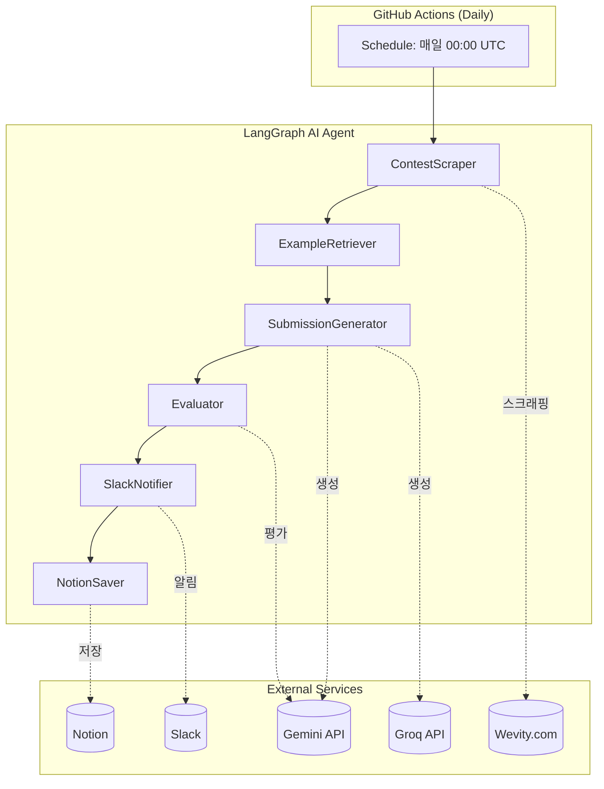
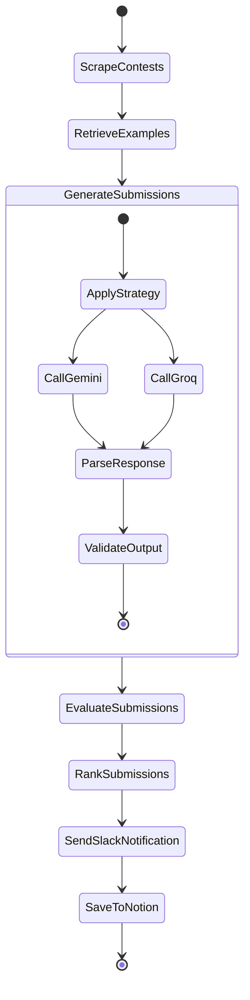

# 🚀 Fast-Naming LangGraph AI Agent 구현 가이드

## 📋 프로젝트 개요

이 Agent는 **매일 GitHub Actions를 통해 자동 실행**되어:
1. Wevity 공모전 사이트에서 진행중인 네이밍/슬로건 공모전을 자동 수집
2. LLM을 활용하여 최적의 작명을 생성 및 평가
3. TOP 3 결과를 Slack으로 알림
4. Notion에 결과를 정리하여 저장

---

## 🏗️ 시스템 아키텍처



---

## 📊 상태 그래프 (State Graph)



---

## 🔧 핵심 컴포넌트 상세

### 1. State 정의

```python
from typing import TypedDict, List, Dict, Optional, Any
from datetime import datetime

class ContestInfo(TypedDict):
    """공모전 정보 구조"""
    title: str                    # 공모전명
    content: str                  # 공모전 상세 내용
    held_by: str                  # 주최기관
    contest_type: str             # 네이밍/슬로건
    held_by_type: str             # 공공기관/사기업/학교
    url: str                      # 공모전 링크
    submission_method: str        # 제출방법
    deadline: Optional[str]       # 마감일

class Submission(TypedDict):
    """생성된 작명"""
    name: str                     # 작명
    description: str              # 작명 이유
    strategy: str                 # 사용된 전략
    provider: str                 # LLM 제공자
    model: str                    # 사용된 모델
    score: Optional[float]        # 평가 점수

class NamingAgentState(TypedDict):
    """Agent 전체 상태"""
    # 수집된 공모전들
    contests: List[ContestInfo]
    current_contest_index: int
    
    # 현재 처리중인 공모전
    current_contest: Optional[ContestInfo]
    
    # Few-shot 예시
    successful_examples: List[Dict[str, str]]
    
    # 생성된 작명들
    submissions: List[Submission]
    
    # 평가 결과
    ranked_submissions: List[Submission]
    top3_submissions: List[Submission]
    
    # 실행 메타데이터
    execution_date: str
    week_info: str  # "2024-12-W3" 형식
    
    # 에러 추적
    errors: List[str]
```

---

### 2. Node 함수들

#### 2.1 공모전 스크래핑 (ContestScraper)

```python
import httpx
from bs4 import BeautifulSoup

async def scrape_contests(state: NamingAgentState) -> NamingAgentState:
    """Wevity에서 접수중인 공모전 목록을 스크래핑"""
    
    BASE_URL = "https://www.wevity.com/?c=find&s=1&gub=1&cidx=25"
    
    async with httpx.AsyncClient() as client:
        response = await client.get(BASE_URL)
        soup = BeautifulSoup(response.text, 'html.parser')
        
        contests = []
        # "접수중" 표시된 공모전만 필터링
        for item in soup.select('.list-item'):
            status = item.select_one('.status')
            if status and '접수중' in status.text:
                link = item.select_one('a')['href']
                detail = await scrape_contest_detail(client, link)
                contests.append(detail)
    
    return {**state, "contests": contests}

async def scrape_contest_detail(client, url: str) -> ContestInfo:
    """개별 공모전 상세 페이지 스크래핑"""
    response = await client.get(url)
    soup = BeautifulSoup(response.text, 'html.parser')
    
    return {
        "title": soup.select_one('.contest-title').text.strip(),
        "content": soup.select_one('.contest-content').text.strip(),
        "held_by": soup.select_one('.organizer').text.strip(),
        "contest_type": detect_contest_type(soup),  # 네이밍/슬로건 판별
        "held_by_type": detect_held_by_type(soup),  # 기관 유형 판별
        "url": url,
        "submission_method": extract_submission_method(soup),
        "deadline": extract_deadline(soup),
    }
```

#### 2.2 작명 생성 (SubmissionGenerator)

```python
from langchain_google_genai import ChatGoogleGenerativeAI
from langchain_groq import ChatGroq
from langchain_core.messages import SystemMessage, HumanMessage

# LLM 클라이언트 초기화
gemini = ChatGoogleGenerativeAI(
    model="gemini-2.0-flash",  # 2024년 12월 기준 최신 모델
    google_api_key=os.getenv("GEMINI_API_KEY")
)

groq = ChatGroq(
    model="openai/gpt-oss-120b",
    api_key=os.getenv("GROQ_API_KEY")
)

# LLM Provider Registry (확장 용이한 구조)
LLM_PROVIDERS = {
    "gemini": gemini,
    "groq": groq,
    # 나중에 추가: "anthropic": anthropic_client,
}

async def generate_submissions(state: NamingAgentState) -> NamingAgentState:
    """다중 LLM과 다중 전략으로 작명 생성"""
    
    contest = state["current_contest"]
    examples = state["successful_examples"]
    
    all_submissions = []
    
    for strategy in CREATIVE_STRATEGIES:
        for provider_name, llm in LLM_PROVIDERS.items():
            try:
                prompt = create_prompt(contest, examples, strategy)
                response = await llm.ainvoke(prompt)
                submissions = parse_response(response.content)
                
                for sub in submissions:
                    sub["strategy"] = strategy["name"]
                    sub["provider"] = provider_name
                    sub["model"] = llm.model_name
                    all_submissions.append(sub)
                    
            except Exception as e:
                state["errors"].append(f"{provider_name}: {str(e)}")
    
    return {**state, "submissions": all_submissions}
```

#### 2.3 Slack 알림 (SlackNotifier)

```python
import httpx
import os

async def send_slack_notification(state: NamingAgentState) -> NamingAgentState:
    """TOP 3 결과를 Slack으로 전송"""
    
    webhook_url = os.getenv("SLACK_WEBHOOK")
    contest = state["current_contest"]
    top3 = state["top3_submissions"]
    
    # Slack Block Kit 메시지 구성
    blocks = [
        {
            "type": "header",
            "text": {"type": "plain_text", "text": "🏆 공모전 작명 추천", "emoji": True}
        },
        {"type": "divider"},
        {
            "type": "section",
            "fields": [
                {"type": "mrkdwn", "text": f"*📌 공모전명:*\n{contest['title']}"},
                {"type": "mrkdwn", "text": f"*🏢 주최기관:*\n{contest['held_by']}"},
            ]
        },
        {
            "type": "section",
            "text": {"type": "mrkdwn", "text": f"*📋 공모전 내용:*\n{contest['content'][:300]}..."}
        },
        {
            "type": "section",
            "fields": [
                {"type": "mrkdwn", "text": f"*🔗 링크:*\n<{contest['url']}|공모전 바로가기>"},
                {"type": "mrkdwn", "text": f"*📝 제출방법:*\n{contest['submission_method']}"},
            ]
        },
        {"type": "divider"},
        {"type": "section", "text": {"type": "mrkdwn", "text": "*🎯 추천 작명 TOP 3*"}},
    ]
    
    # TOP 3 작명 추가
    for i, sub in enumerate(top3, 1):
        medal = ["🥇", "🥈", "🥉"][i-1]
        blocks.append({
            "type": "section",
            "text": {
                "type": "mrkdwn",
                "text": f"{medal} *{sub['name']}*\n_{sub['description']}_\n`점수: {sub['score']:.1f}`"
            }
        })
    
    async with httpx.AsyncClient() as client:
        await client.post(webhook_url, json={"blocks": blocks})
    
    return state
```

#### 2.4 Notion 저장 (NotionSaver)

```python
# Notion MCP 또는 Notion API 직접 호출

async def save_to_notion(state: NamingAgentState) -> NamingAgentState:
    """결과를 Notion에 저장
    
    구조:
    - 2024년-12월-3주차 (페이지)
        - [공모전명] (하위 페이지)
            - 출품작 TOP 3 내용
    """
    
    notion_token = os.getenv("NOTION_API_KEY")
    parent_page_id = os.getenv("NOTION_PARENT_PAGE_ID")  # 결과를 저장할 상위 페이지
    
    week_info = state["week_info"]  # "2024년-12월-3주차"
    contest = state["current_contest"]
    top3 = state["top3_submissions"]
    
    # 1. 주차 페이지 찾기 또는 생성
    week_page = await find_or_create_page(
        parent_id=parent_page_id,
        title=week_info
    )
    
    # 2. 공모전 페이지 생성
    contest_page = await create_page(
        parent_id=week_page["id"],
        title=contest["title"],
        properties={
            "URL": contest["url"],
            "마감일": contest["deadline"],
        }
    )
    
    # 3. 출품작 내용 추가
    content_blocks = []
    for i, sub in enumerate(top3, 1):
        medal = ["🥇", "🥈", "🥉"][i-1]
        content_blocks.extend([
            {"type": "heading_2", "text": f"{medal} {sub['name']}"},
            {"type": "paragraph", "text": sub["description"]},
            {"type": "paragraph", "text": f"점수: {sub['score']:.1f} | 전략: {sub['strategy']}"},
        ])
    
    await append_blocks(contest_page["id"], content_blocks)
    
    return state
```

---

### 3. Graph 구성

```python
from langgraph.graph import StateGraph, END

# 그래프 생성
workflow = StateGraph(NamingAgentState)

# 노드 추가
workflow.add_node("scrape_contests", scrape_contests)
workflow.add_node("retrieve_examples", retrieve_examples)
workflow.add_node("generate_submissions", generate_submissions)
workflow.add_node("evaluate_submissions", evaluate_submissions)
workflow.add_node("rank_submissions", rank_submissions)
workflow.add_node("send_slack", send_slack_notification)
workflow.add_node("save_notion", save_to_notion)

# 엣지 정의 (순차 실행)
workflow.add_edge("scrape_contests", "retrieve_examples")
workflow.add_edge("retrieve_examples", "generate_submissions")
workflow.add_edge("generate_submissions", "evaluate_submissions")
workflow.add_edge("evaluate_submissions", "rank_submissions")
workflow.add_edge("rank_submissions", "send_slack")
workflow.add_edge("send_slack", "save_notion")
workflow.add_edge("save_notion", END)

# 시작점
workflow.set_entry_point("scrape_contests")

# 컴파일
app = workflow.compile()
```

---

## 🎨 6가지 창의적 전략

```python
CREATIVE_STRATEGIES = [
    {
        "name": "Keyword Combination",
        "description": "핵심 키워드 조합",
        "prompt_injection": """
        **전략: 핵심 키워드 조합**
        - 주최사의 핵심 정체성과 가치에 집중하세요.
        - 공모전 설명에서 핵심 단어들을 추출하세요.
        - 추출한 키워드들을 창의적으로 결합하여 작명하세요.
        """
    },
    {
        "name": "Metaphor & Analogy",
        "description": "은유와 비유",
        "prompt_injection": """
        **전략: 은유와 비유**
        - 공모전 주제가 무엇과 비슷한지 생각하세요. (등대? 도약대? 캔버스?)
        - 은유적 상징을 활용하여 감성을 자극하는 작명을 만드세요.
        """
    },
    {
        "name": "Benefit-Oriented",
        "description": "혜택 중심",
        "prompt_injection": """
        **전략: 혜택 중심 접근**
        - 사용자가 얻게 될 가치나 혜택에만 집중하세요.
        - 슬로건만 들어도 긍정적 결과가 떠오르도록 만드세요.
        """
    },
    {
        "name": "Wordplay & Wit",
        "description": "언어유희와 재치",
        "prompt_injection": """
        **전략: 언어유희와 재치**
        - 재치 있는 말장난, 중의적 표현, 기발한 줄임말을 활용하세요.
        - 기억에 오래 남는 매력적인 작명을 만드세요.
        """
    },
    {
        "name": "Future Vision",
        "description": "미래 비전",
        "prompt_injection": """
        **전략: 미래 비전 제시**
        - 주최사가 만들고자 하는 이상적인 미래를 상상하세요.
        - '혁신', '발전', '도약' 등 미래 지향적 느낌을 주세요.
        """
    },
    {
        "name": "Simple & Direct",
        "description": "단순함과 직관성",
        "prompt_injection": """
        **전략: 단순함과 직관성**
        - 불필요한 수식어를 제거하고 본질에 집중하세요.
        - 짧고 간결하며 누구나 쉽게 기억할 수 있어야 합니다.
        """
    },
]
```

---

## ⚙️ GitHub Actions 워크플로우

```yaml
# .github/workflows/naming-agent.yml

name: Daily Naming Agent

on:
  schedule:
    # 매일 UTC 00:00 (한국시간 09:00)
    - cron: '0 0 * * *'
  workflow_dispatch:  # 수동 실행 가능

env:
  GEMINI_API_KEY: ${{ secrets.GEMINI_API_KEY }}
  GROQ_API_KEY: ${{ secrets.GROQ_API_KEY }}
  SLACK_WEBHOOK: ${{ secrets.SLACK_WEBHOOK }}
  NOTION_API_KEY: ${{ secrets.NOTION_API_KEY }}
  NOTION_PARENT_PAGE_ID: ${{ secrets.NOTION_PARENT_PAGE_ID }}

jobs:
  run-agent:
    runs-on: ubuntu-latest
    
    steps:
      - name: Checkout repository
        uses: actions/checkout@v4
      
      - name: Set up Python
        uses: actions/setup-python@v5
        with:
          python-version: '3.12'
      
      - name: Install dependencies
        run: |
          cd agent
          pip install -r requirements.txt
      
      - name: Run Naming Agent
        run: |
          cd agent
          python main.py
      
      - name: Upload results artifact
        uses: actions/upload-artifact@v4
        with:
          name: agent-results-${{ github.run_number }}
          path: agent/results/
          retention-days: 30
```

---

## 📦 필요한 의존성 (requirements.txt)

```txt
# LangGraph & LangChain
langgraph>=0.2.0
langchain>=0.3.0
langchain-google-genai>=2.0.0
langchain-groq>=0.2.0

# HTTP & 스크래핑
httpx>=0.27.0
beautifulsoup4>=4.12.0
lxml>=5.0.0

# Notion API
notion-client>=2.2.0

# 유틸리티
python-dotenv>=1.0.0
pydantic>=2.0.0

# 비동기 지원
asyncio>=3.4.3
aiohttp>=3.9.0
```

---

## 🔐 환경 변수 (.env)

```env
# LLM API Keys
GEMINI_API_KEY=your_gemini_api_key_here
GROQ_API_KEY=your_groq_api_key_here

# Slack
SLACK_WEBHOOK=https://hooks.slack.com/services/xxx/xxx/xxx

# Notion
NOTION_API_KEY=secret_xxx
NOTION_PARENT_PAGE_ID=your_parent_page_id_here
```

---

## 📝 Notion MCP 연동 안내

> [!IMPORTANT]
> **Notion MCP 연동을 위해 필요한 사항:**

### 필요 조건
1. **Notion Integration 생성**
   - https://www.notion.so/my-integrations 에서 새 Integration 생성
   - "Internal Integration" 타입 선택
   - 생성된 `Internal Integration Token`을 `NOTION_API_KEY`로 사용

2. **페이지 접근 권한 부여**
   - 결과를 저장할 Notion 페이지에서 우측 상단 `...` 클릭
   - `Connections` → 생성한 Integration 선택
   - 이 페이지의 ID를 `NOTION_PARENT_PAGE_ID`로 사용

3. **페이지 ID 확인 방법**
   - Notion 페이지 URL: `https://www.notion.so/Page-Title-abc123def456`
   - 마지막 32자리 (`abc123def456...`)가 페이지 ID

### 현재 MCP 상태
현재 이 환경에는 Notion MCP 서버가 설정되어 있지 않습니다.
두 가지 방법으로 Notion 연동이 가능합니다:

1. **Notion API 직접 사용** (권장)
   - `notion-client` Python 라이브러리 사용
   - GitHub Actions에서 바로 실행 가능
   - 위 코드 예시가 이 방식을 사용

2. **Notion MCP 서버 설정** (로컬 개발용)
   - Claude Desktop 등에서 MCP 설정 필요
   - GitHub Actions에서는 사용 불가

---

## ✅ 구현 체크리스트

### Phase 1: 기반 구축
- [ ] `agent/` 디렉토리 구조 생성
- [ ] `requirements.txt` 작성
- [ ] State 스키마 정의 (`state.py`)
- [ ] 환경변수 로드 설정

### Phase 2: 스크래핑
- [ ] Wevity 목록 페이지 스크래핑
- [ ] 공모전 상세 페이지 스크래핑
- [ ] 제출방법 추출 로직

### Phase 3: LLM 생성
- [ ] Gemini 클라이언트 설정
- [ ] Groq 클라이언트 설정
- [ ] 6가지 전략 프롬프트 구현
- [ ] 응답 파싱 로직

### Phase 4: 평가
- [ ] 평가 기준 생성
- [ ] 작명 채점 로직
- [ ] TOP 3 선별

### Phase 5: 알림 & 저장
- [ ] Slack Incoming Webhook 연동
- [ ] Notion API 연동
- [ ] 주차별 페이지 구조 생성

### Phase 6: 자동화
- [ ] GitHub Actions 워크플로우 작성
- [ ] Secrets 설정
- [ ] 테스트 실행

---

## 📚 참고 자료

- [LangGraph 공식 문서](https://langchain-ai.github.io/langgraph/)
- [Gemini API](https://ai.google.dev/)
- [Groq API](https://console.groq.com/)
- [Slack Incoming Webhooks](https://api.slack.com/messaging/webhooks)
- [Notion API](https://developers.notion.com/)
